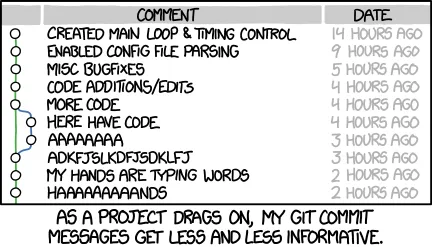
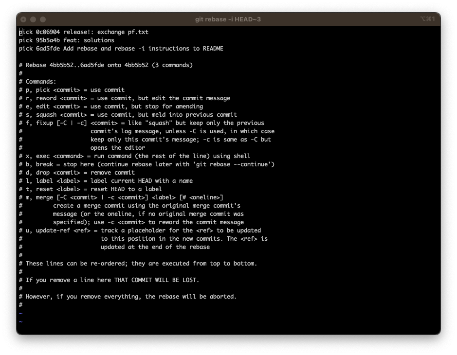
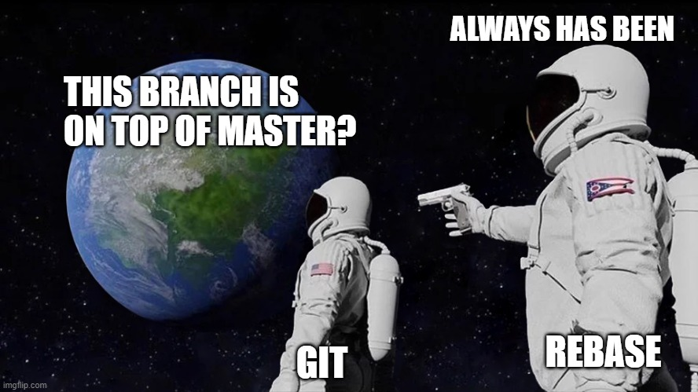
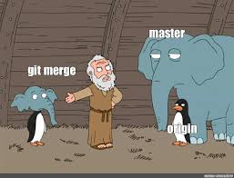
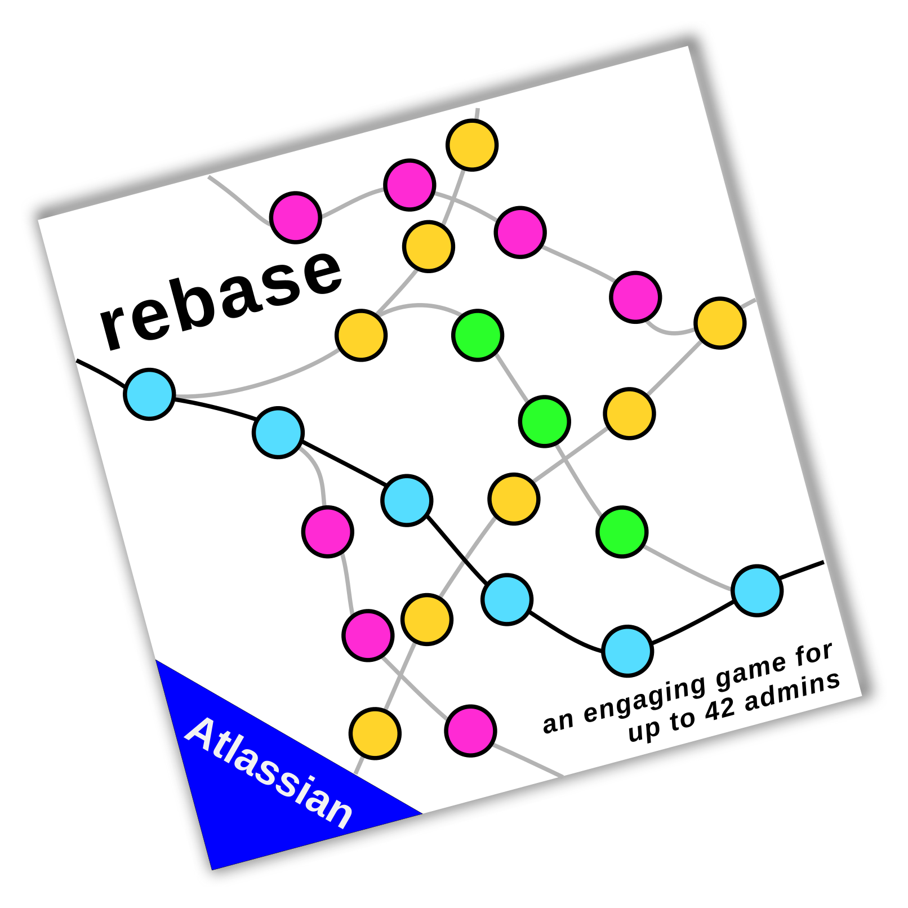

# Rebase Playground 🎮

Welcome to the Rebase Playground, where version history becomes a journey of twists, turns, and lessons! 🚀

## About



In this repository, you'll find a collection of scenarios designed to help you master the art of rebasing on GitHub. By exploring these scenarios, you'll learn how to navigate the exciting world of rebase, make your commit history more coherent, and avoid common pitfalls.

<br clear="left"/>

## How to Play

### Getting started

1. **Clone the repository**: 

   ```bash
   git clone <repository-url>
   cd Rebase-Playground
   ```

2. **Checkout scenario branches**: 

   ```bash
   git checkout <scenario-branch>
   ```

### Rebasing

1. **Ensure your base branch is up to date**:

   ```bash
   git checkout <base-branch>
   git pull
   ```

2. **Checkout your scenario branch**: 

   ```bash
   git checkout <scenario-branch>
   ```
   or
   ```bash
   git checkout -
   ```

3. **Rebase the scenario branch**: 

   ```bash
   git rebase <base-branch>
   ```


4. **Force push**: 

   ```bash
   git push --force
   ```

### Interactive Rebasing

1. **Checkout your scenario branch**: 

   ```bash
   git checkout <scenario-branch>
   ```

3. **Start the interactive rebase**: 

   ```bash
   git rebase -i HEAD~<number of commits you would like to change>
   ```

4. **Learn how to use vim**: Check [here](https://opensource.com/article/19/3/getting-started-vim) for a short introduction



5. **Safe your changes**

6. **force push**

   ```bash
   git push --force
   ```

## Scenarios to Explore

1. **Conflicting Changes**: Navigate through conflicting changes and learn how to resolve conflicts during a rebase.



2. **Rebasing Public Branches**: Experience the challenges of rebasing when collaborating on public branches.

3. **Interactive Rebasing**: Get hands-on with interactive rebasing, and sculpt your commit history like an artist.

4. **Rebasing Feature Branches**: Rebase a feature branch onto the latest changes in the main branch to prevent a complex merge conflict later down the road.

5. **Rebasing Long-Lived Feature Branches:** Experience how rebasing a long-lived feature branch onto the main branch periodically can help keep the branch up-to-date and reduce the risk of merge conflicts.



6. **Force Push Pitfall**: Discover the consequences of force pushing after rebasing and learn how to avoid pitfalls.

7. **Collaboration and Communication**: Dive into the importance of collaboration and communication during the rebase process.

<br clear="left"/>

## Ready to Begin?


Let's embark on a journey to enhance our Git skills and understand the art of rebasing! Pick a scenario branch, follow the instructions, and immerse yourself in the world of branching, rebasing, and collaboration.

Remember, this playground is all about exploration and learning, so don't hesitate to try new things, ask questions, and share your discoveries. Happy rebasing! 🎉

<br clear="left"/>

## Guidelines



For all work outside of this repository, please follow these guildelines to ensure a smooth workflow. The rebase method is supposed to help you and your team with your work, not become a fun game for 42 admins. 

1. **Avoid rebasing deployment branches:**
Rebasing public branches needs good communication and planning and should not be done regularly. If you need to rebase a deployment branch, please communicate it with **everyone** beforehand. Therefore in repositories with more then one deployment branch (e.g. main and develop), I would advise to use merge commits between them.

2. **Communicate:** 
If you plan to rebase a branch that others are collaborating on, communicate your intention to prevent conflicts and confusion.

3. **Backup before rebasing**
Create a backup branch or stash your changes before initiating a rebase. This ensures you can recover easily if something goes wrong.
This can be done as follows:
``` bash
git checkout -b <feature branch> <backup of feature branch>
```

4. **Keep your branches up to date:**
Long standing feature branches should be rebased regularly to avoid many merge conflicts. 
Before merging a PR into a deployment branch, please rebase your branch on the base branch and clean up your commit history.

6. **Ask if you're unsure:**
Introducing rebasing into your workflow can be a challenge, especially at the beginning. If you are unsure about something, ask your team and plan together. 